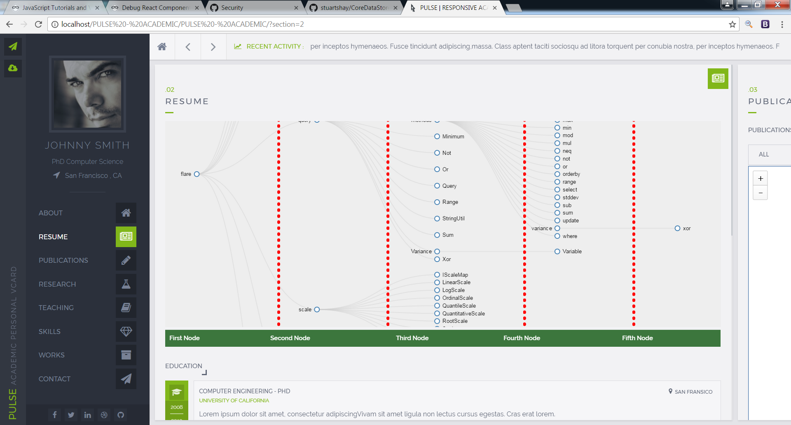

# d3-visualsThere are some data visualizations like treechart, bubblechart, mbostock, mapchart using d3.js.
I added Bubblechart, TreeChart, Mbostock1, Mbostock2, Highchart(Map) into Bootstrap template.
## D3: Data-Driven Documents
D3 (or D3.js) is a JavaScript library for visualizing data using web standards. D3 helps you bring data to life using SVG, Canvas and HTML. D3 combines powerful visualization and interaction techniques with a data-driven approach to DOM manipulation, giving you the full capabilities of modern browsers and the freedom to design the right visual interface for your data.

D3 allows you to bind arbitrary data to a Document Object Model (DOM), and then apply data-driven transformations to the document. For example, you can use D3 to generate an HTML table from an array of numbers. Or, use the same data to create an interactive SVG bar chart with smooth transitions and interaction.

D3 is not a monolithic framework that seeks to provide every conceivable feature. Instead, D3 solves the crux of the problem: efficient manipulation of documents based on data. This avoids proprietary representation and affords extraordinary flexibility, exposing the full capabilities of web standards such as HTML, SVG, and CSS. With minimal overhead, D3 is extremely fast, supporting large datasets and dynamic behaviors for interaction and animation. D3�s functional style allows code reuse through a diverse collection of official and community-developed modules.
## Installing
If you use npm, `npm install d3`. Otherwise, download the [latest release](https://github.com/d3/d3/releases/tag/v4.9.1). The released bundle supports anonymous AMD, CommonJS, and vanilla environments. You can load directly from [d3js.org](https://d3js.org/), [CDNJS](https://cdnjs.com/libraries/d3), or [unpkg](https://unpkg.com/d3@4.9.1/). For example:

``

For the minified version:

``

You can also use the standalone D3 microlibraries. For example, [d3-selection](https://github.com/d3/d3-selection):

``

D3 is written using [ES2015 modules](http://2ality.com/2014/09/es6-modules-final.html). Create a [custom bundle using Rollup](https://bl.ocks.org/mbostock/bb09af4c39c79cffcde4), Webpack, or your preferred bundler. To import D3 into an ES2015 application, either import specific symbols from specific D3 modules:

`import {scaleLinear} from "d3-scale";`

Or import everything into a namespace (here, `d3`):

`import * as d3 from "d3";`

In Node:

`var d3 = require("d3");`

You can also require individual modules and combine them into a `d3` object using [Object.assign](https://developer.mozilla.org/en-US/docs/Web/JavaScript/Reference/Global_Objects/Object/assign):

`var d3 = Object.assign({}, require("d3-format"), require("d3-geo"), require("d3-geo-projection"));`

## Results
1|2
:---:|:--:
|
|
|